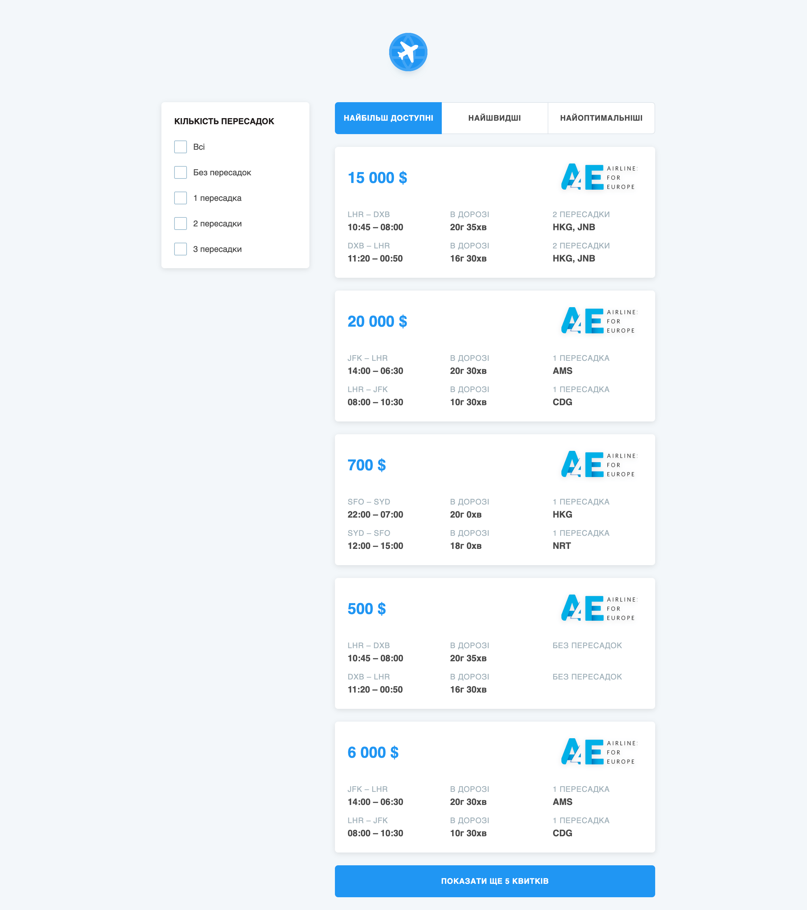
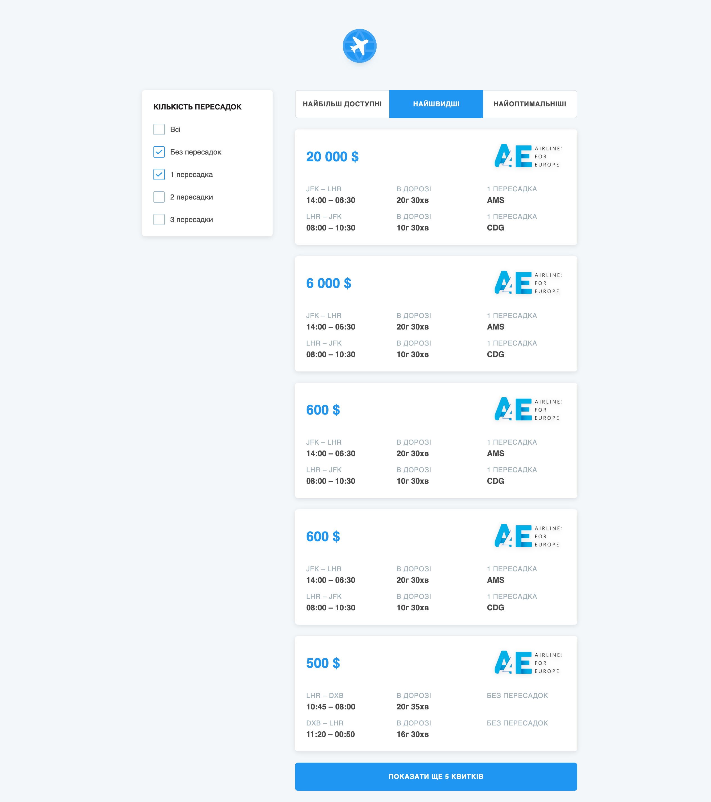
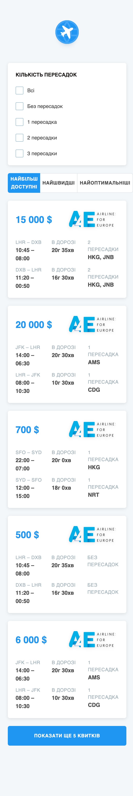

# Flight Tickets Filter

This is a React project designed for filtering and sorting flight tickets. The application provides a user-friendly interface to view, filter, and sort flight tickets based on various criteria.

## Features

- **Ticket List**: Displays a list of flight tickets.
- **Filter**: Allows filtering tickets based on various parameters.
- **Sort**: Enables sorting tickets by price, flight time, and other criteria.
- **Pagination**: Manages ticket list pagination.

## Installation

1. Clone the repository:

   `git clone https://github.com/moroz-art-dev/flight-tickets-filter.git`

2. Navigate to the project directory:

   `cd flight-tickets-filter`

3. Install the dependencies using npm:

   `npm install`

4. (Optional) Create a `.env` file in the root directory for any environment variables if needed.

## Usage

1. Start the development server:

   `npm start`

2. Open your web browser and visit [http://localhost:3000](http://localhost:3000) to see the application in action.

## Demo

You can also check out the live demo of this app at [moroz-art-dev.github.io/flight-tickets-filter/](https://moroz-art-dev.github.io/flight-tickets-filter/).

## Project Structure

- **App.tsx**: Main application component.
- **api/ticketsService.ts**: API service for fetching ticket data.
- **app/**: Contains application-wide configurations and Redux setup.
  - **store/redux/features/**: Redux slices and related files for filter, sort, and tickets.
- **assets/**: Static assets including icons and styles.
- **components/**: React components organized by features and layout.
- **config/**: Configuration files for filters and sorting.
- **containers/**: Container components managing business logic.
- **i18n/**: Internationalization setup.
- **pages/**: Page-level components.
- **tools/**: Utility functions and custom hooks.
- **index.tsx**: Entry point of the application.
- **reportWebVitals.ts**: Web vitals reporting.
- **setupTests.ts**: Test setup file.

## Technologies Used

- **React**: JavaScript library for building user interfaces.
- **Redux Toolkit**: State management library.
- **Sass**: CSS preprocessor.
- **TypeScript**: Superset of JavaScript for type safety.
- **React Router**: Library for routing in React applications.
- **i18next**: Internationalization library.

## API

This project fetches flight ticket data from an external API. The API endpoint and configuration details can be found in `api/ticketsService.ts`.

## Screenshots

## License

This project is licensed under the MIT License.
